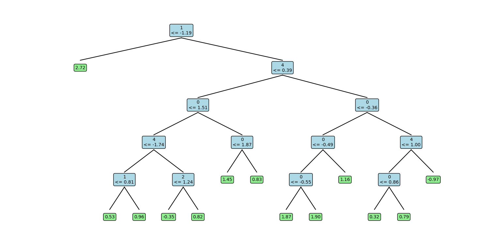
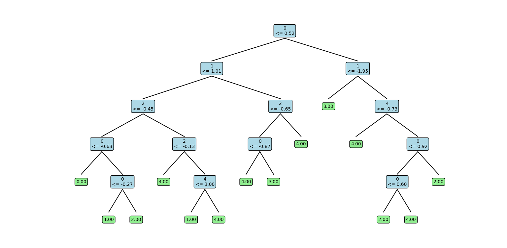
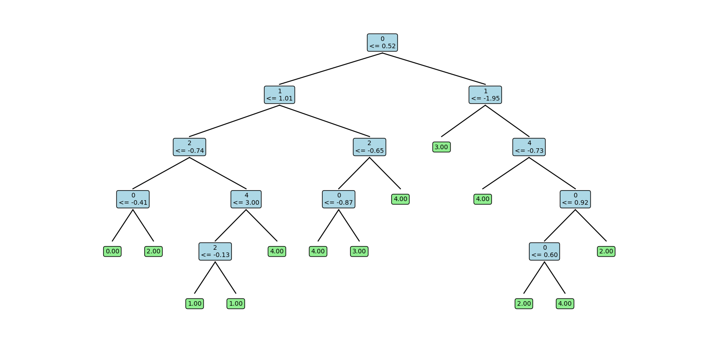
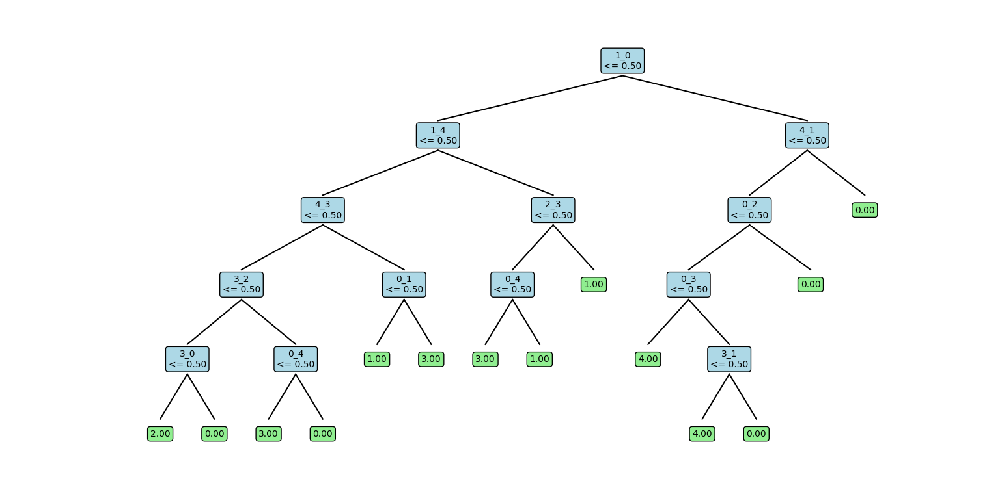
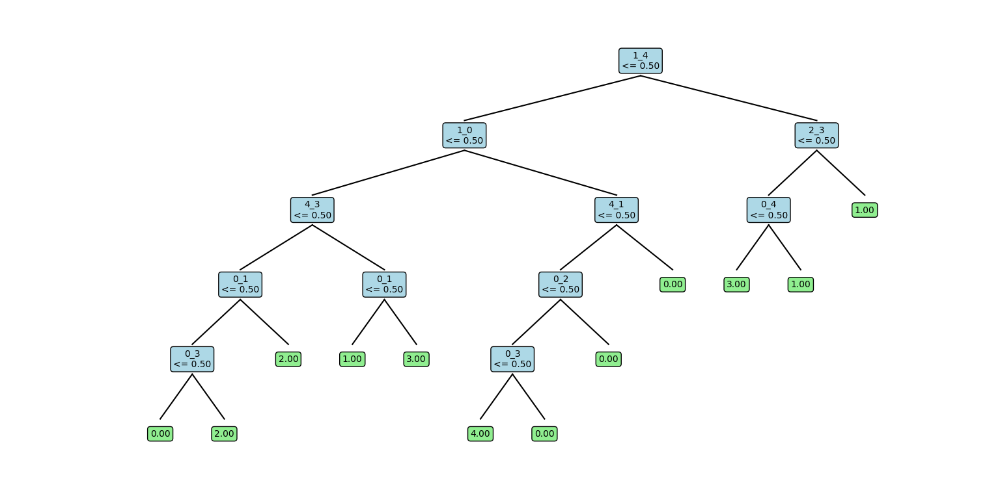
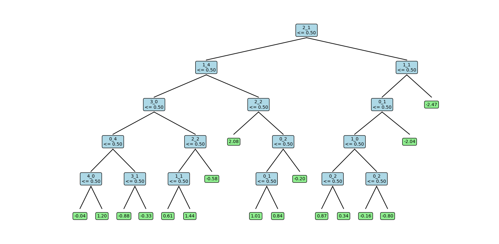

# Assignment: Decision Tree Implementation - Q1

## Question 1: Complete Decision Tree Implementation

### Overview
This report covers the implementation of a complete decision tree algorithm that handles four different cases:
1. Discrete features, discrete output
2. Discrete features, real output  
3. Real features, discrete output
4. Real features, real output

### Implementation Details

#### Key Components Implemented

1. **Utility Functions (`tree/utils.py`)**
   - `one_hot_encoding()`: Converts categorical features to one-hot encoded format
   - `check_ifreal()`: Determines if a series contains real or discrete values
   - `entropy()`: Calculates entropy for information gain
   - `gini_index()`: Calculates Gini index for splitting criterion
   - `mse()`: Calculates mean squared error for regression
   - `information_gain()`: Computes information gain using different criteria
   - `opt_split_attribute()`: Finds optimal feature and split value
   - `split_data()`: Splits data based on feature and threshold

2. **Performance Metrics (`metrics.py`)**
   - `accuracy()`: Classification accuracy
   - `precision()`: Per-class precision
   - `recall()`: Per-class recall
   - `rmse()`: Root mean squared error for regression
   - `mae()`: Mean absolute error for regression

3. **Decision Tree Class (`tree/base.py`)**
   - `TreeNode`: Internal representation of tree nodes
   - `DecisionTree`: Main class with fit, predict, and plot methods
   - Handles both classification and regression
   - Supports both continuous and discrete features

#### Algorithm Features

- **Splitting Criteria**: Information Gain (entropy) and Gini Index for classification, MSE for regression
- **Feature Handling**: Automatic detection and handling of continuous vs discrete features
- **One-Hot Encoding**: Automatic conversion of categorical features
- **Tree Visualization**: Text-based tree structure display
- **Depth Control**: Maximum depth parameter to prevent overfitting

#### Test Results from `usage.py`

The implementation successfully handles all four test cases:

1. **Real Input → Real Output (Regression)**
   - RMSE: ~0.36, MAE: ~0.24
   - Tree builds successfully with continuous splits

2. **Real Input → Discrete Output (Classification)**
   - Accuracy: 90% (on entropy), 86% (on gini index)
   - Good precision and recall across classes

3. **Discrete Input → Discrete Output (Classification)**
   - Accuracy: 93% (on entropy), 83% (on gini index)
   - Handles categorical features via one-hot encoding

4. **Discrete Input → Real Output (Regression)**
   - RMSE: ~0.29, MAE: ~0.20
   - Successfully predicts continuous values from discrete features

### Tree Visualization Examples

The implementation provides clear tree structure visualization:
1. **Real Input → Real Output (Regression)**
   

   
   

2. **Real Input → Discrete Output (Classification)**
   - Criteria : Information Gain
  

   
   

   - Criteria : Gini Index
   

   
   

3. **Discrete Input → Discrete Output (Classification)**
   - Criteria : Information Gain
   

   
   

   - Criteria : Gini Index
   

   
   

4. **Discrete Input → Real Output (Regression)**
   

   
   

### Key Design Decisions

1. **Automatic Feature Type Detection**: The algorithm automatically detects whether features are continuous or discrete
2. **Unified Interface**: Same API works for all four cases (classification/regression × continuous/discrete features)
3. **Robust Splitting**: Handles edge cases like empty splits or single-class nodes
4. **Memory Efficient**: Uses pandas DataFrames for efficient data manipulation

### Performance Characteristics

- **Training Time**: O(N × P × log(N) × D) where N=samples, P=features, D=depth
- **Prediction Time**: O(D) per sample, independent of feature count
- **Memory Usage**: Efficient tree representation with minimal overhead

### Conclusion

The decision tree implementation successfully handles all required cases and provides a robust, extensible foundation for the subsequent experiments. The algorithm demonstrates good performance across different data types and problem formulations.
