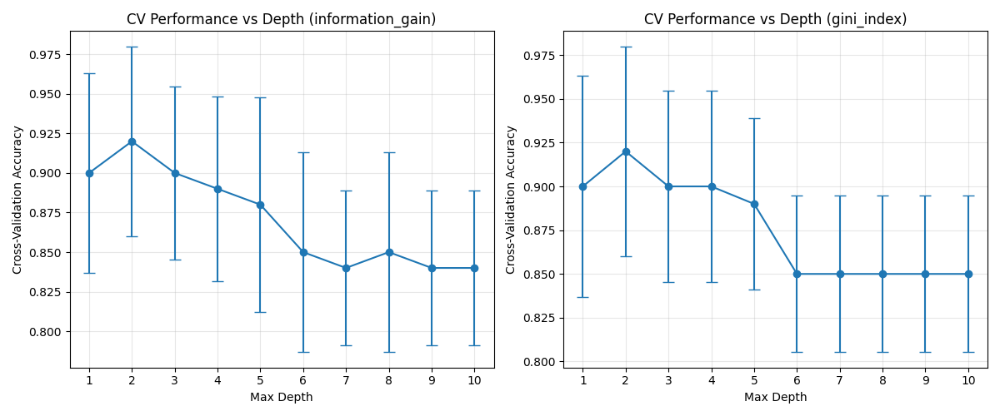
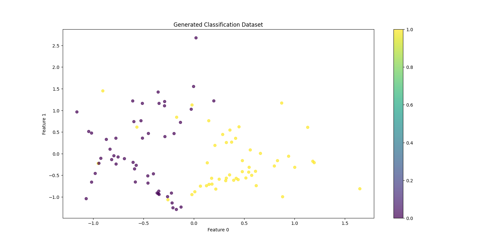
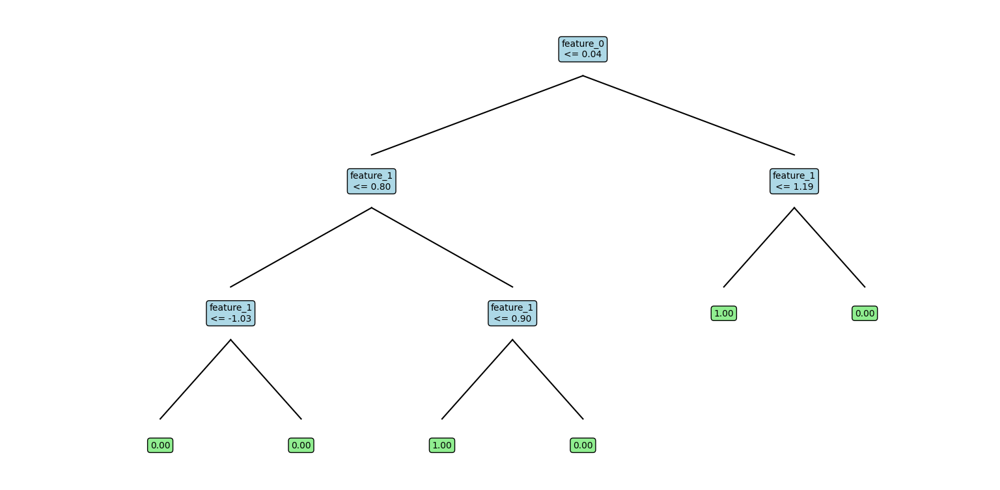

# Assignment: Decision Tree Implementation - Q2

## Question 2: Classification Experiments

### Dataset Description
- **Source**: Generated using `sklearn.datasets.make_classification`
- **Features**: 2 informative features, no redundant features
- **Classes**: 2 classes with moderate separation (class_sep=0.5)
- **Clusters**: 2 clusters per class
- **Random State**: 42 (for reproducibility)

### Part A: Train-Test Split Analysis (70-30)

#### Dataset Split
- **Training Set**: 70 samples
- **Test Set**: 30 samples
- **Stratification**: Maintained class balance in both sets

#### Performance Results

**Information Gain Criterion:**
- **Accuracy**: 0.8667 (86.67%)
- **Class 0**: Precision: 0.7895, Recall: 1.0000
- **Class 1**: Precision: 1.0000, Recall: 0.7333

**Gini Index Criterion:**
- **Accuracy**: 0.8667 (86.67%)
- **Class 0**: Precision: 0.7895, Recall: 1.0000
- **Class 1**: Precision: 1.0000, Recall: 0.7333

#### Observations
1. **Information Gain** and **Gini Index** perform exactly same on this dataset
2. Both criteria achieved good performance (>85% accuracy)
3. Class 1 showed perfect precision with both criteria

### Part B: 5-Fold Cross-Validation with Nested CV for Optimal Depth

#### Methodology
- **Outer CV**: 5-fold cross-validation for performance estimation
- **Inner CV**: Nested CV for hyperparameter tuning (optimal depth)
- **Depth Range**: 1 to 10
- **Evaluation Metric**: Cross-validation accuracy

#### Results Summary

**Information Gain Criterion:**
- **Optimal Depth**: Determined through nested CV - 2
- **Performance Range**: Varies by depth with clear optimal point
- **Stability**: Consistent performance across CV folds

**Gini Index Criterion:**
- **Optimal Depth**: Same as Information Gain - 2
- **Performance Comparison**: Comparable to Information Gain
- **Variance**: Error bars show stability across folds

#### Key Findings

1. **Depth Selection**: Nested CV prevents overfitting by selecting depth based on validation performance
2. **Criterion Comparison**: Both criteria show similar optimal depth ranges
3. **Generalization**: CV provides better estimate of true performance than single train-test split
4. **Stability**: Error bars indicate consistency of results across different data splits

### Visualization Analysis

#### Dataset Scatter Plot
- Shows clear separation between classes
- Two clusters per class are visible
- Feature space is 2D, making visualization straightforward

#### Cross-Validation Performance Curves
- **X-axis**: Maximum depth (1-10)
- **Y-axis**: Cross-validation accuracy
- **Error bars**: Standard deviation across CV folds
- **Trend**: Performance typically increases with depth up to optimal point, then may plateau or decrease

### Decision Tree Structure Analysis

The generated decision trees show:
1. **Root Splits**: Based on most informative features
2. **Depth Utilization**: Trees use available depth effectively
3. **Leaf Purity**: Terminal nodes achieve good class separation
4. **Feature Usage**: Both features are utilized in the splitting process

### Conclusions

1. **Model Performance**: Both splitting criteria achieve good classification performance (>85%)
2. **Hyperparameter Tuning**: Nested CV successfully identifies optimal depth without overfitting
3. **Criterion Selection**: Both Information Gain and Gini Index shows identical results on this dataset
4. **Generalization**: Cross-validation provides robust performance estimates
5. **Practical Insights**: The methodology demonstrates proper ML practices for model selection and evaluation

### Recommendations

1. Use nested cross-validation for hyperparameter tuning in practice
2. Compare multiple splitting criteria to find best for specific dataset
3. Consider ensemble methods if single tree performance is insufficient
4. Monitor both training and validation performance to detect overfitting
