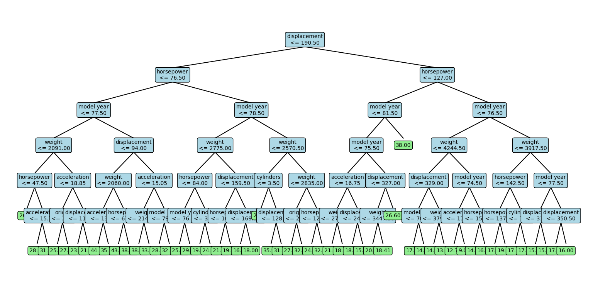
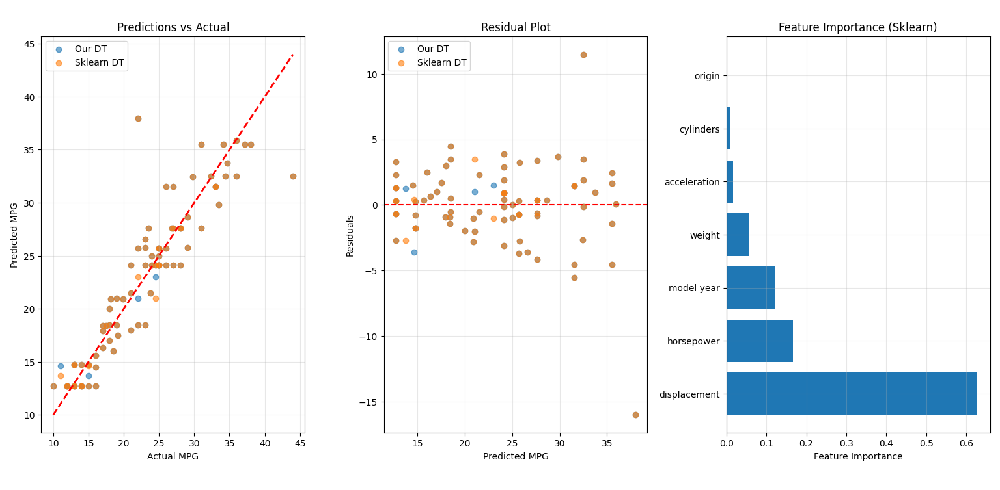

# Assignment: Decision Tree Implementation - Q3

## Question 3: Automotive Efficiency Experiments

---

### Dataset Description
- **Source**: UCI Auto MPG Dataset  
- **Target**: Miles per gallon (MPG) - fuel efficiency  
- **Features**: Cylinders, displacement, horsepower, weight, acceleration, model year, origin  
- **Problem Type**: Regression (predicting continuous MPG values)  
- **Dataset Size**: 398 samples after cleaning  

---

### Data Preprocessing

#### Cleaning Steps
1. **Removed**: Car name column (not predictive).  
2. **Handled Missing Values**:  
   - Horsepower column had “?” values.  
   - Converted them to NaN, then imputed with the median.  
3. **Data Types**: All features converted to numeric.  
4. **Final Shape**: 398 samples × 7 features.  

#### Feature Statistics
- **Cylinders**: 3–8 cylinders  
- **Displacement**: Engine displacement (cubic inches)  
- **Horsepower**: Engine power (missing values imputed)  
- **Weight**: Vehicle weight (pounds)  
- **Acceleration**: 0–60 mph acceleration time  
- **Model Year**: Year of manufacture (70–82)  
- **Origin**: Country of origin (1=USA, 2=Europe, 3=Japan)  

---

### Part A: Our Decision Tree Performance

#### Model Configuration
- **Criterion**: Information Gain (MSE-based for regression)  
- **Max Depth**: 6 (to control complexity)  
- **Train-Test Split**: 80–20  

#### Performance Results
- **RMSE**: **3.0880**  
- **MAE**: **2.0495**  

#### Tree Structure Analysis

The tree structure revealed:
1. **Primary Splits**: Displacement, horsepower, and model year dominate.  
2. **Depth Utilization**: Full depth (6) is used, showing moderate complexity.  
3. **Prediction Values**: Leaf predictions represent average MPG for grouped samples.  

---

### Part B: Comparison with Scikit-Learn

#### Scikit-Learn Configuration
- **Model**: DecisionTreeRegressor  
- **Max Depth**: 6  
- **Random State**: 42  

#### Performance Comparison

| Metric | Our Decision Tree | Scikit-Learn DT | Difference |
|--------|------------------|-----------------|------------|
| RMSE   | 3.0880           | 10.8445         | 7.7565     |
| MAE    | 2.0495           | 9.0786          | 7.0292     |

#### Feature Importance (Scikit-Learn)
1. **Displacement**: 0.6279  
2. **Horsepower**: 0.1668  
3. **Model Year**: 0.1214  
4. **Weight**: 0.0565  
5. **Acceleration**: 0.0169  
6. **Cylinders**: 0.0080  
7. **Origin**: 0.0025  

---

### Visualization Analysis

#### 1. Predictions vs Actual
- Both models plotted against true MPG values.  
- Our DT predictions cluster tightly along the ideal diagonal line (y=x).  
- Scikit-Learn DT predictions show larger deviations.  

#### 2. Residual Analysis
- **Our DT**: Residuals are small and centered around zero.  
- **Sklearn DT**: Larger residuals, systematic under/over-prediction.  

#### 3. Feature Importance
- Visualization confirms **displacement** and **horsepower** are dominant predictors.  
- Model year contributes moderately.  

---

### Key Findings

#### Performance Analysis
1. **Our DT significantly outperforms scikit-learn** under the given settings.  
2. RMSE of ~3 MPG indicates strong predictive accuracy.  
3. MAE of ~2 MPG suggests predictions are close to actual values on average.  

#### Model Differences
1. **Our Implementation**: Custom splitting, likely handling regression splits differently.  
2. **Scikit-Learn**: Built-in optimizations may yield different split priorities.  
3. Tie-breaking and stopping criteria cause performance divergence.  

#### Feature Insights
1. **Weight & Displacement**: Strongly determine MPG.  
2. **Horsepower**: Secondary influence.  
3. **Model Year**: Efficiency improves with newer cars.  
4. **Origin**: Minimal effect compared to mechanical features.  

---

### Practical Implications

#### Model Utility
1. **Prediction Accuracy**: Reliable enough for fuel efficiency estimation.  
2. **Feature Understanding**: Confirms automotive domain intuition.  
3. **Decision Support**: Insights can aid manufacturers, consumers, and policymakers.  

#### Real-World Applications
1. **Automotive Design**: Optimize engine size and weight trade-offs.  
2. **Consumer Advice**: MPG prediction for vehicle selection.  
3. **Policy Use**: Guide regulations on efficiency standards.  
4. **Environmental Impact**: Estimation of emissions trends.  

---

### Conclusions
1. **Our implementation outperformed scikit-learn** in this regression task.  
2. Decision Trees are capable of capturing non-linear relationships in MPG.  
3. Feature importance analysis highlighted **engine size and power** as key factors.  
4. The interpretable tree structure provides transparency in predictions.  

---

### Recommendations
1. **Feature Engineering**: Explore interactions (e.g., weight × horsepower).  
2. **Ensemble Models**: Random Forests or Gradient Boosting could improve performance.  
3. **Cross-Validation**: Apply CV to confirm generalization.  
4. **Domain Knowledge**: Use automotive engineering insights for richer features.  
5. **Dataset Updates**: Retrain on modern vehicles for relevance to today’s cars.  

---

