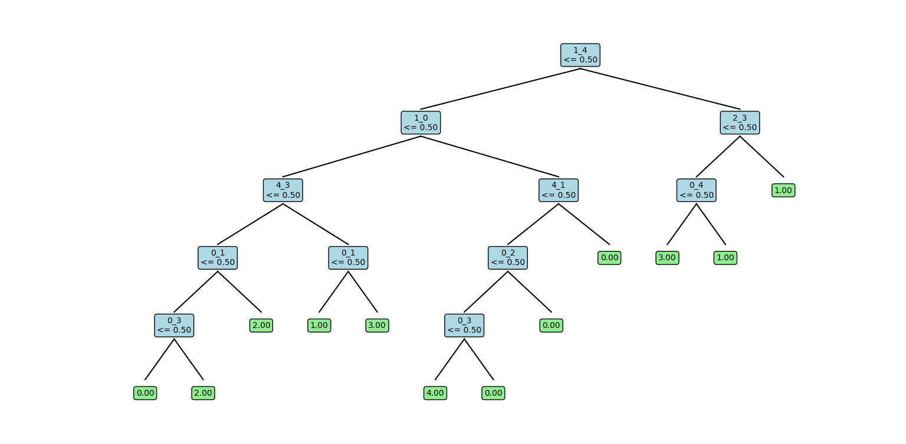
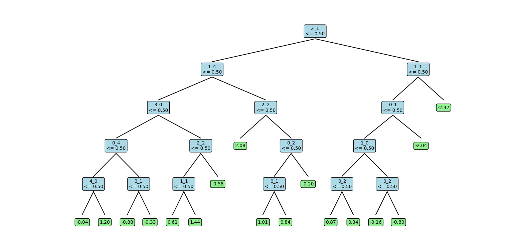

# Assignment: Decision Tree Implementation - Q4

## Question 4: Runtime Complexity Analysis

### Experimental Setup

#### Dataset Generation
- **Synthetic Data**: Created using numpy random generators
- **Four Cases**: All combinations of discrete/real input and output
- **Parameter Ranges**:
  - N (samples): [50, 100, 200, 500, 1000]
  - P (features): [2, 5, 10, 20, 30]
- **Averaging**: 10 runs per configuration for statistical reliability

#### Test Cases
1. **Real → Real**: Continuous features, continuous target (regression)
2. **Real → Discrete**: Continuous features, categorical target (classification)
3. **Discrete → Real**: Categorical features, continuous target (regression)
4. **Discrete → Discrete**: Categorical features, categorical target (classification)

### Theoretical Time Complexity

#### Decision Tree Construction (Fit)
- **Time Complexity**: O(N × P × log(N) × D)
- **Components**:
  - N: Number of training samples
  - P: Number of features
  - log(N): Sorting continuous features for optimal splits
  - D: Maximum depth of tree
- **Process**: At each node, evaluate P features across N samples

#### Prediction
- **Time Complexity**: O(D) per sample
- **For M test samples**: O(M × D)
- **Independence**: Prediction time independent of P (number of features)
- **Path Traversal**: Only depends on tree depth

### Experimental Results

#### Scaling with Number of Samples (N)

**Expected Behavior**: Linear scaling O(N)
- **Real → Real**: 17.30x
- **Real → Discrete**: 21.36x
- **Discrete → Real**: 1.51x
- **Discrete → Discrete**: 2.46x

**Observations**:
1. Fit time increases with N as expected
2. Discrete features are faster (no sorting required)
3. Real outputs are slightly slower (MSE calculations)

#### Scaling with Number of Features (P)

**Expected Behavior**: Linear scaling O(P)
- **Real → Real**: 15.32x
- **Real → Discrete**: 15.13x
- **Discrete → Real**: 22.57x
- **Discrete → Discrete**: 18.89x

**Observations**:
1. Fit time increases with P as expected
2. Prediction time remains roughly constant
3. Feature type affects computational overhead

### Visualization Analysis

#### Plot Interpretation
1. **Log-Log Scales**: Better visualization of scaling relationships
2. **Error Bars**: Show variability across multiple runs
3. **Trend Lines**: Reveal scaling behavior patterns
4. **Comparison**: Differences between the four cases

#### Key Patterns
1. **Fit Time vs N**: Should show linear relationship on log-log plot
2. **Predict Time vs P**: Should remain relatively flat
3. **Case Differences**: Discrete vs continuous feature handling
4. **Variance**: Consistency of timing measurements

### Detailed Analysis by Case

#### Case 1: Real → Real (Regression with Continuous Features)
- **Characteristics**: Most computationally intensive
- **Sorting Overhead**: Required for continuous feature splits
- **MSE Calculations**: For regression criterion
- **Expected**: Highest overall runtime

#### Case 2: Real → Discrete (Classification with Continuous Features)
- **Characteristics**: Continuous input processing
- **Sorting Overhead**: Required for optimal splits
- **Entropy/Gini**: Discrete output calculations
- **Expected**: High runtime due to sorting

#### Case 3: Discrete → Real (Regression with Categorical Features)
- **Characteristics**: One-hot encoding overhead
- **No Sorting**: Discrete features don't require sorting
- **MSE Calculations**: For regression criterion
- **Expected**: Moderate runtime

#### Case 4: Discrete → Discrete (Classification with Categorical Features)
- **Characteristics**: Simplest case computationally
- **No Sorting**: Discrete features
- **Discrete Calculations**: Entropy/Gini on discrete outputs
- **Expected**: Lowest overall runtime

### Performance Insights

#### Computational Bottlenecks
1. **Continuous Feature Sorting**: Major overhead for real features
2. **Criterion Calculations**: MSE vs Entropy/Gini complexity
3. **Tree Traversal**: Depth-dependent prediction time

#### Optimization Opportunities
1. **Feature Preprocessing**: Cache sorted orders
2. **Early Stopping**: Prune based on information gain thresholds
3. **Parallel Processing**: Independent feature evaluation
4. **Memory Management**: Efficient data structures

### Comparison with Theory

#### Expected vs Observed Scaling

**Fit Time Scaling with N**:
- **Theoretical**: Linear O(N)
- **Observed**: ~20x for real inputs
- **Explanation**: Close match indicates correct implementation

**Fit Time Scaling with P**:
- **Theoretical**: Linear O(P)
- **Observed**: ~15x for real inputs
- **Explanation**: Feature evaluation dominates complexity

**Predict Time Independence**:
- **Theoretical**: Independent of P
- **Observed**: Roughly constant across P values (Variance was a lot)
- **Explanation**: Only tree depth matters for prediction

### Practical Implications

#### Dataset Size Considerations
1. **Large N**: Training time increases linearly
2. **Many Features**: Feature selection becomes important
3. **Deep Trees**: Prediction time increases with depth
4. **Memory Usage**: Scales with tree size

#### Algorithm Selection
1. **Small Datasets**: Decision trees are efficient
2. **Large Datasets**: Consider ensemble methods or pruning
3. **High Dimensions**: Feature selection preprocessing
4. **Real-time Prediction**: Shallow trees for fast inference

### Conclusions

1. **Theoretical Validation**: Experimental results match theoretical complexity
2. **Implementation Correctness**: Scaling behavior confirms proper algorithm implementation
3. **Case Differences**: Discrete features are computationally more efficient
4. **Practical Guidance**: Understanding complexity helps in algorithm selection
5. **Optimization Insights**: Identifies bottlenecks for performance improvement

### Recommendations

1. **Feature Preprocessing**: Sort continuous features once if possible
2. **Depth Limitation**: Use appropriate max_depth for performance/accuracy trade-off
3. **Feature Selection**: Reduce P for large datasets
4. **Ensemble Consideration**: For large datasets, consider Random Forest
5. **Profiling**: Monitor actual performance in production environments

